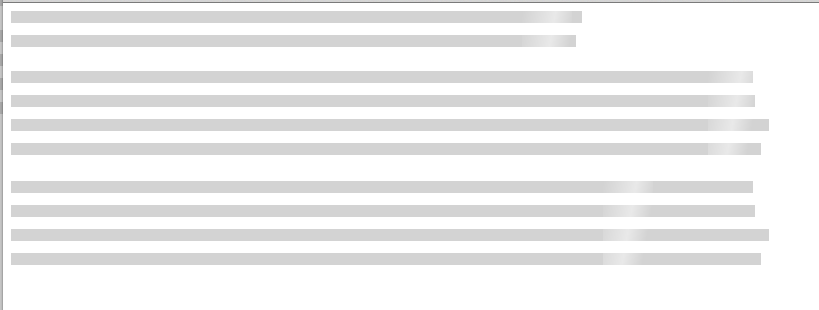

# SkeletonLoader.js (Heavy WIP)
Programmatic Skeleton Loading with plan javascript

Uses data attributes and the css :empty selector to create simple Skeleton Loaders (like the ones found on facebook). More implementation coming soon! 

